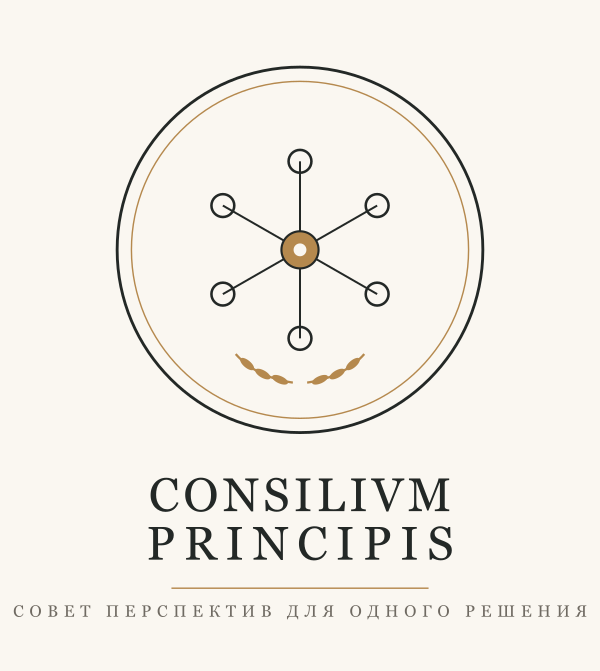

<div align="center">



# Consilium Principis

**Личный совет директоров из великих умов — для твоих решений.**

Несколько мыслителей за одним столом. Говорят их голосами, по их же текстам.
Спорят с тобой и между собой. И **не выдумывают цитаты** — это вшито в основу.

</div>

---

## Как это выглядит

Ты спрашиваешь обычными словами:

> **«Развиваю AI-лабораторию, делаю всё сразу. На чём сфокусироваться?»**

И получаешь не один обтекаемый ответ, а **заседание**, где каждый смотрит со своей колокольни — и они расходятся:

> **Чарли Мангер** 🟡 «У тебя не стратегия, а список дел. Где у тебя *edge*? Если в трёх направлениях из четырёх честный ответ "нет" — это убить, а не оптимизировать.»
>
> **Naval Ravikant** 🟡 «Вижу не четыре бизнеса, а один движок через четыре рычага. Время не масштабируется; код и медиа работают, пока ты спишь — вес туда.»
>
> **Марк Аврелий** 🔵 «Let it be thy earnest and incessant care as a Roman and a man to perform whatsoever it is that thou art about» *(Meditations, пер. Long)* — делай настоящее дело целиком; четыре дела разом — рассеяние.
> ↳ а спросишь то, чего у него в текстах нет — **честно промолчит, а не сочинит цитату.**

→ Дальше — **синтез** (где они на самом деле сходятся) и **один шаг к действию**. Несогласие здесь фича: ты видишь решение с углов, которые сам бы пропустил.

<sub>Пример иллюстративен. 🟡 — мысль в духе автора (модель рассуждает его линзой), 🔵 — дословная строка с источником в корпусе. Полное реальное заседание — в [`council/sessions/`](council/sessions/).</sub>

## Что можно спросить

Не нужно учить команды — скажи **«что умеешь?»**, и совет покажет меню. Например:

- **«Что может пойти не так с моим запуском?»** — премортем: где сломается, что укрепить заранее
- **«Что бы сказал Аврелий про выгорание?»** — один советник, строго по его текстам
- **«Пусть Мангер и Naval поспорят про X»** — столкнуть два взгляда
- **«Помоги выиграть этот спор»** — разбор позиции как шахматный движок: твои ходы, контрмеры, честный вердикт
- **«Не противоречу ли я себе?»** — зеркало: что говоришь vs что выбираешь на деле

## Почему этому можно верить

Это не «чат-бот в роли мудреца». Каждое слово помечено **защитным контуром**:

| Маркер | Что значит |
|:---:|---|
| 🔵 | **дословная цитата** из подлинного корпуса — проверена посимвольно, с источником |
| 🟡 | **мысль в духе автора**, но не его точные слова — честно отмечено |
| *отказ* | вопрос вне корпуса → советник **молчит, а не сочиняет** |

Плюс **анти-лесть**: советник держит свою линзу и скорее оспорит, чем поддакнет. Контур работает на любой машине — без интернета, без ключей, без оплаты. Слабее только меткость поиска, **никогда — честность**.

**По умолчанию — по-человечески:** совет отвечает **на твоём языке** и даёт чистый вывод без лишних чисел. 🔵-цитата остаётся в оригинале (так её можно проверить) + перевод рядом. Нужен полный разбор — вероятности, устойчивость позиции, разметка по источникам — скажи «покажи детали».

## Установка

**Самое простое — поставит сам Claude.** Открой Claude Code и дай ссылку:

> «Поставь мне этот навык: `https://github.com/ilyautov/consilium-principis`»

Claude склонирует репозиторий, запустит `python3 install.py` (копия в `~/.claude/skills/`,
самопроверка) и отчитается. Ни ключей, ни терминала. Потом скажи **«с чего начать»** — соберёт
стартовый совет (Марк Аврелий + Эпиктет, public-domain) за пару минут.

Не сработало с первого раза — дай Claude это дословно:
```bash
git clone https://github.com/ilyautov/consilium-principis ~/consilium-principis
cd ~/consilium-principis && python3 install.py
```

Любишь кнопки или терминал — [`QUICKSTART.md`](QUICKSTART.md): клик-установщик
([`install.command`](install.command) / `.bat`) и ручной путь.

**Cowork / Claude Desktop / любой MCP-хост** — подключи как MCP-сервер и получи весь цикл
(сборка, заседания, виджеты) тулами, не выходя из агента: [`CONNECT-MCP.md`](CONNECT-MCP.md)
(`python3 scripts/board.py mcp-config` подставит путь сам).

**Нужно только:** Python 3.10+. Для умного кросс-язычного поиска — опционально
[ollama](https://ollama.com) + `bge-m3` (совет сам подскажет, как поднять). Контур работает и без него.

## Твой совет — твой выбор

**Пустая доска из коробки — это норма.** Кого посадить за стол — решаешь ты; совет личный.
Public-domain мудрецы (стоики, Сунь-цзы…) собираются одной фразой. Современных мыслителей —
из материалов, которые принесёшь сам.

> ⚖️ **Граница.** Навык не качает копирайтные книги. Public-domain — свободно; копирайт — только
> твои легальные копии. Твоя доска (`advisors/`) и твой профиль — личные данные, в репозиторий не уходят.

## Как устроено

Под капотом — поиск по корпусу с тремя режимами (от чистого Python до семантического) и мягкой
деградацией. Защитный контур — отдельный слой поверх: он сверяет каждую цитату с источником и не
зависит от того, какой режим поиска активен. Поэтому честность одинакова на любой машине.
Детали — [`SKILL.md`](SKILL.md) и [`docs/`](docs/superpowers/specs/).

---

<div align="center">
<sub>Consilium Principis · ранний доступ · <a href="LICENSE">MIT</a></sub>
</div>
