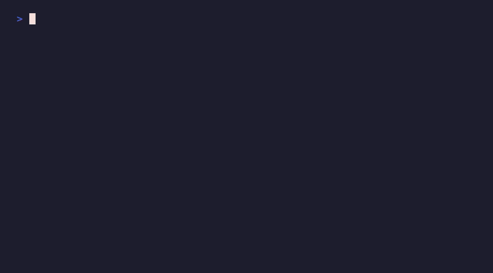
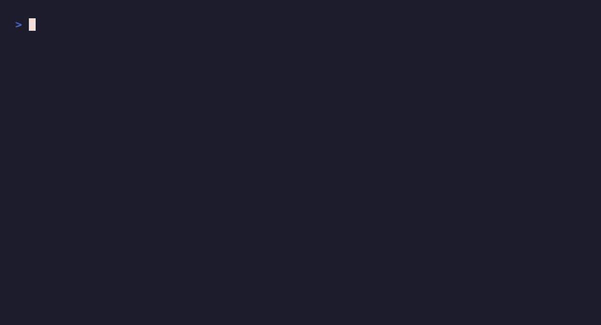

# Галерея демо

Короткие (`<10 сек`) записи реальных прогонов. Общий принцип: **каждый кадр несёт
проверяемое кодом ядро, а не постановку.** Вердикты 🔵/🟡, снятие маркера и числа
считаются живым кодом на каждом прогоне (не хардкод); скрипт падает, если гейт не
подтверждает заявленное. Все фигуры — public-domain (Аврелий, Сунь-цзы, Макиавелли).

Воспроизвести: `vhs scripts/demo/<name>.tape`. Английские варианты — `<name>.en.tape`.

---

## 1. Докажет цитату или промолчит

Выдуманную «цитату Аврелия» совет отвергает, реальную строку подтверждает 🔵 слово-в-слово
с источником. Ядро рва одним кадром.

Код: `scripts/demo/refusal_demo.py` · гейт `_fidelity_check` · EN: `assets/demo-refusal-en.gif`

---

## 2. Цитата не в тех устах

Одну и ту же реальную строку Аврелия отдают в двух устах: Макиавелли (чужой корпус →
маркер снят) и самому Аврелию (свой корпус → 🔵 держится). Даже верную цитату у неверного
автора код ловит. Этого нет ни у кого.

Код: `scripts/demo/misattribution_demo.py` · валидатор `_validate_session_attribution` · EN: `assets/demo-misattribution-en.gif`

---

## 3. Посчитано, а не на глаз

Считаемый вопрос («выпустить публично или подождать») совет не решает афоризмом, а прогоняет
твою модель 10 000 раз (Monte Carlo, сид 2026, воспроизводимо): распределение исхода,
P(лучший), главный рычаг. Честная плашка: это не истина, это твоя модель.

Код: `scripts/demo/montecarlo_demo.py` · ядро `run_calculation`/`mc_run` · EN: `assets/demo-montecarlo-en.gif`

---

## 4. Спросил по-русски, 🔵 по английскому тексту

Вопрос на русском, корпус английский. Совет переводит запрос в язык корпуса (это его работа),
и КОД сверяет найденную строку дословно → 🔵 с источником. Язык любой, верность та же.

Код: `scripts/demo/crosslingual_demo.py` · сверка `_fidelity_check` (перевод — ризонинг совета, не код) · EN-нарратив: `assets/demo-crosslingual-en.gif`

---

## 5. Клэш совета (иллюстративный)

Разные линзы расходятся. Честная пометка прямо в кадре: доводы 🟡 — прочтение модели линзой
автора, НЕ сверенные слова; проверяется только одна 🔵-строка (её сверяет живой гейт). Так
даже иллюстрация несёт проверяемое ядро и не превращается в театр «N мнений спорят».

Код: `scripts/demo/clash_demo.py` · 🔵-ядро через `_fidelity_check`, доводы 🟡 host-генерируемые · EN: `assets/demo-clash-en.gif`

---

Гарды честности демо: `tests/test_refusal_demo.py`, `tests/test_montecarlo_demo.py`,
`tests/test_demo_scenarios.py` (вердикт из живого кода, ноль техношума в кадре, ноль
длинного тире). Раскадровка и принципы — `docs/demo/demo-scenario.md`.
